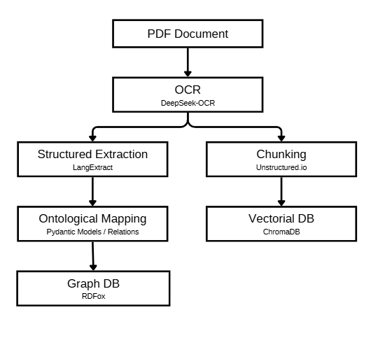

# PDF Ingestion API

A FastAPI-based REST API for ingesting PDF documents and performing semantic search queries using ChromaDB as the vector database.

## Table of Contents

- [Features](#features)
- [Architecture](#architecture)
- [Prerequisites](#prerequisites)
- [Installation](#installation)
- [Building](#building)
- [Running](#running)
- [REST API Endpoints](#rest-api-endpoints)
- [Docker Deployment](#docker-deployment)

## Features

- **PDF Ingestion**: Upload PDF documents that are automatically chunked and stored in a vector database
- **Semantic Search**: Perform semantic queries across ingested documents
- **Duplicate Detection**: Automatically detects and prevents duplicate document ingestion using MD5 hashing
- **RESTful API**: Clean, versioned REST API endpoints
- **Docker Support**: Full Docker and Docker Compose support for easy deployment

## Architecture


### Vector Database Configuration

The system utilizes a **unified vector space** in ChromaDB for both text and image embeddings:

| Content Type | Embedding Model | Purpose |
|--------------|-----------------|---------|
| **Text** | [pplx-embed-v1-0.6B](https://huggingface.co/perplexity-ai/pplx-embed-v1-4b) | Text embeddings for semantic search |
| **Images** | [Qwen/Qwen3.5-0.8B](https://huggingface.co/Qwen/Qwen3.5-0.8B) | Image description embeddings via local inference |

### Image Embedding Process

Images are processed using the following pipeline:

1. **Image Description**: Images are described using the [Qwen/Qwen3.5-0.8B](https://huggingface.co/Qwen/Qwen3.5-0.8B) model from Hugging Face
2. **Local Inference**: The model is loaded via [LM Studio](https://lmstudio.ai/) which creates a Local Server with access to the local network
3. **Unified Embedding**: Image descriptions are embedded in the same vector space as text content
4. **Base64 Storage**: The original image is saved as base64-encoded data alongside its embedding

This unified architecture provides:
- **Simplicity**: Single vector space for all content types
- **Semantic Consistency**: Image descriptions and text share the same embedding space for coherent search results
- **Local Processing**: Image descriptions are generated locally via LM Studio, ensuring data privacy

## Prerequisites

- Python 3.11 or higher
- pip (Python package manager)
- Docker and Docker Compose

## Installation

1. **Clone the repository**:
   ```bash
   git clone <repository-url>
   cd IngestionLayer
   ```

3. [Build](#building)
4. [Run](#running)


## Building

### Build Docker Image

```bash
# Build the Docker image
docker build -t pdf-ingestion-api .

# Build with specific tag
docker build -t pdf-ingestion-api:latest .
```

### Build Using Docker Compose

```bash
docker-compose build
```

## Running

### Using Docker

```bash
# Run the container
docker run -d -p 8001:8001 -v $(pwd)/chroma-data:/app/chroma-data --name pdf-ingestion-api pdf-ingestion-api
```

### Using Docker Compose

```bash
# Start the services
docker-compose up
```

## REST API Endpoints

Base URL: `http://localhost:8001/v1`

### Health Check

Check if the API is running and healthy.

| Method | Endpoint | Status Code |
|--------|----------|-------------|
| GET | `/health` | 200 OK |


**Example Response:**
```json
{
  "status": "ok"
}
```

---

### Ingest Document

Upload a PDF document for processing and storage in the vector database.

| Method | Endpoint | Status Code |
|--------|----------|-------------|
| POST | `/documents` | 201 Created |


**Request Parameters:**

| Parameter | Type | Required | Description |
|-----------|------|----------|-------------|
| file | UploadFile | Yes | PDF file to ingest (application/pdf) |

**Success Response (201 Created):**
```json
{
  "document_id": "550e8400-e29b-41d4-a716-446655440000",
  "filename": "document.pdf",
  "num_chunks": 15
}
```

**Error Responses:**

| Status Code | Description |
|-------------|-------------|
| 400 Bad Request | The uploaded file must be a PDF |
| 409 Conflict | This document has already been ingested |
| 422 Unprocessable Entity | No chunks were stored for this document |

**400 Bad Request Example:**
```json
{
  "detail": "The uploaded file must be a PDF."
}
```

**409 Conflict Example:**
```json
{
  "detail": "This document has already been ingested."
}
```

**422 Unprocessable Entity Example:**
```json
{
  "detail": "No chunks were stored for this document."
}
```

---

### Query Documents

Perform semantic search across ingested documents.

| Method | Endpoint | Status Code |
|--------|----------|-------------|
| POST | `/query` | 200 OK |


**Request Body:**

| Field | Type | Required | Default | Description |
|-------|------|----------|---------|-------------|
| query | string | Yes | - | The search query text |
| top_k | integer | No | 5 | Number of results to return |

**Success Response (200 OK):**
```json
{
  "query": "machine learning algorithms",
  "results": [
    {
      "id": "chunk-uuid-1",
      "text": "Machine learning is a subset of artificial intelligence...",
      "score": 0.95,
      "metadata": {
        "document_id": "550e8400-e29b-41d4-a716-446655440000",
        "pdf_hash": "abc123def456"
      }
    },
    {
      "id": "chunk-uuid-2",
      "text": "Deep learning algorithms have revolutionized...",
      "score": 0.87,
      "metadata": {
        "document_id": "550e8400-e29b-41d4-a716-446655440000",
        "pdf_hash": "abc123def456"
      }
    }
  ]
}
```

**Error Responses:**

| Status Code | Description |
|-------------|-------------|
| 400 Bad Request | Query must not be empty |

**400 Bad Request Example:**
```json
{
  "detail": "Query must not be empty."
}
```

---

## Docker Deployment

### Dockerfile Configuration

The Dockerfile is configured with:
- Python 3.11 slim base image
- Port 8001 exposed
- Automatic ChromaDB data persistence via volume mounting

### Docker Compose Configuration

The `docker-compose.yml` defines:
- Service name: `pdf-ingestion-api`
- Port mapping: 8001:8001
- Volume persistence for ChromaDB data
- Build context: current directory

## API Documentation

Interactive API documentation is available at:
- **Swagger UI**: http://localhost:8001/docs
- **ReDoc**: http://localhost:8001/redoc
