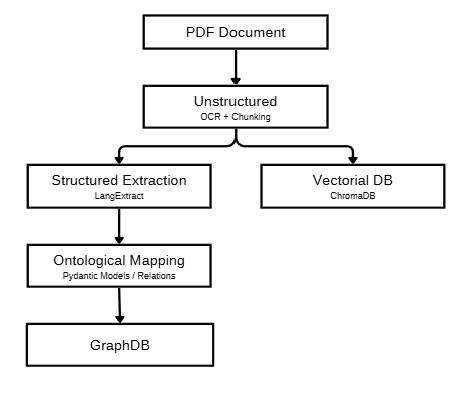
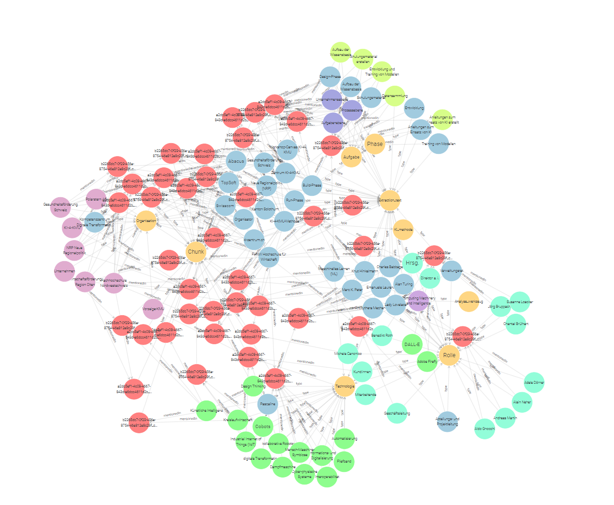

# PDF Ingestion API

A FastAPI-based REST API for ingesting PDF documents and performing semantic search queries using ChromaDB as the vector database.

## Table of Contents

- [Features](#features)
- [Architecture](#architecture)
- [Prerequisites](#prerequisites)
- [Installation](#installation)
- [Building](#building)
- [Running](#running)
- [REST API Endpoints](#rest-api-endpoints)
- [Docker Deployment](#docker-deployment)

## Features

- **Async PDF Ingestion**: Upload PDF documents and poll for results — no blocking on long-running processing
- **Semantic Search**: Perform semantic queries across ingested documents
- **Duplicate Detection**: Automatically detects and prevents duplicate document ingestion using MD5 hashing
- **RESTful API**: Clean, versioned REST API following HTTP async job conventions (RFC 7231 §6.3.3)
- **Docker Support**: Full Docker and Docker Compose support for easy deployment

## Architecture


## Graph Database Integration
The system includes a GraphDB integration that stores extracted entities and their relationships. The graph database provides structured knowledge representation alongside the vector database for semantic search.

### Graph Database Schema
The system uses a custom ontology defined in `ontology/ki_kmu_schema.yaml` that includes:

- **Entity Types**: Organizations, People, Locations, Technologies, Projects, etc.
- **Relationships**: Mentions, collaborations, affiliations, and other semantic connections
- **Attributes**: Entity properties and metadata

### Example Graph Result
Here's an example of the graph structure generated from document processing:



The graph visualization shows:
- **Nodes**: Extracted entities (colored by type)
- **Edges**: Relationships between entities
- **Labels**: Entity names and types
- **Attributes**: Additional metadata about entities and relationships

This structured representation enables:
- Complex relationship queries
- Knowledge graph exploration
- Entity-centric analysis
- Cross-document entity linking

### Vector Database Configuration

The system utilizes a **unified vector space** in ChromaDB for both text and image embeddings:

| Content Type | Embedding Model | Purpose |
|--------------|-----------------|---------|
| **Text** | [pplx-embed-v1-0.6B](https://huggingface.co/perplexity-ai/pplx-embed-v1-4b) | Text embeddings for semantic search |
| **Images** | [Qwen/Qwen3.5-0.8B](https://huggingface.co/Qwen/Qwen3.5-0.8B) | Image description embeddings via local inference |

### Image Embedding Process

Images are processed using the following pipeline:

1. **Image Description**: Images are described using the [Qwen/Qwen3.5-0.8B](https://huggingface.co/Qwen/Qwen3.5-0.8B) model from Hugging Face
2. **Local Inference**: The model is loaded via [LM Studio](https://lmstudio.ai/) which creates a Local Server with access to the local network
3. **Unified Embedding**: Image descriptions are embedded in the same vector space as text content
4. **Base64 Storage**: The original image is saved as base64-encoded data alongside its embedding

This unified architecture provides:
- **Simplicity**: Single vector space for all content types
- **Semantic Consistency**: Image descriptions and text share the same embedding space for coherent search results
- **Local Processing**: Image descriptions are generated locally via LM Studio, ensuring data privacy

## Prerequisites

- [Python 3.11](https://www.python.org/downloads/release/python-3110/) or higher
- [pip](https://pypi.org/project/pip/) (Python package manager)
- [Docker](https://www.docker.com/) and Docker Compose

## Installation

1. **Clone the repository**:
   ```bash
   git clone <repository-url>
   cd IngestionLayer
   ```

3. [Build](#building)
4. [Run](#running)


## Building

### Build Docker Image

```bash
docker build -t pdf-ingestion-api .

docker build -t pdf-ingestion-api:latest .
```

### Build Using Docker Compose

```bash
docker-compose build
```

## Running

### Using Docker

```bash
docker run -d -p 8001:8001 -v $(pwd)/chroma-data:/app/chroma-data --name pdf-ingestion-api pdf-ingestion-api
```

### Using Docker Compose

```bash
docker-compose up
```

## REST API Endpoints

Base URL: `http://localhost:8001/v1`

---

### Health Check

Check if the API is running and healthy.

| Method | Endpoint | Status Code |
|--------|----------|-------------|
| GET | `/health` | 200 OK |

**Response:**
```json
{
  "status": "ok"
}
```

---

### Ingest Document

Upload a PDF document to start ingestion. Processing happens asynchronously — the endpoint returns immediately with a job reference. Use [Get Job Status](#get-job-status) to poll for the result.

| Method | Endpoint | Status Code |
|--------|----------|-------------|
| POST | `/documents` | 202 Accepted |

**Request:** `multipart/form-data`

| Parameter | Type | Required | Description |
|-----------|------|----------|-------------|
| `file` | UploadFile | Yes | PDF file to ingest (`application/pdf`) |

**Response `202 Accepted`:**

Includes a `Location` response header pointing to the job status URL.

```json
{
  "job_id": "550e8400-e29b-41d4-a716-446655440000",
  "status": "pending",
  "status_url": "/v1/jobs/550e8400-e29b-41d4-a716-446655440000"
}
```

**Error Responses:**

| Status Code | Description |
|-------------|-------------|
| 400 Bad Request | The uploaded file must be a PDF |

---

### Get Job Status

Poll the status of a previously submitted ingestion job. Repeat until `status` is `completed` or `failed`.

| Method | Endpoint | Status Code |
|--------|----------|-------------|
| GET | `/jobs/{job_id}` | 200 OK |

**Path Parameters:**

| Parameter | Type | Description |
|-----------|------|-------------|
| `job_id` | string (UUID) | The job ID returned by `POST /documents` |

**Job Status Values:**

| Status | Description |
|--------|-------------|
| `pending` | Job accepted, not yet started |
| `processing` | Ingestion is in progress |
| `completed` | Ingestion finished successfully |
| `failed` | Ingestion encountered an error |

**Response `200 OK` — completed:**
```json
{
  "job_id": "550e8400-e29b-41d4-a716-446655440000",
  "status": "completed",
  "filename": "document.pdf",
  "document_id": "aabbccdd-1234-5678-abcd-000000000000",
  "num_chunks": 15,
  "error": null
}
```

**Response `200 OK` — failed:**
```json
{
  "job_id": "550e8400-e29b-41d4-a716-446655440000",
  "status": "failed",
  "filename": "document.pdf",
  "document_id": null,
  "num_chunks": null,
  "error": "No chunks were stored for this document."
}
```

**Error Responses:**

| Status Code | Description |
|-------------|-------------|
| 404 Not Found | No job found for the given `job_id` |

---

### Query Documents

Perform semantic search across ingested documents.

| Method | Endpoint | Status Code |
|--------|----------|-------------|
| POST | `/query` | 200 OK |

**Request Body (`application/json`):**

| Field | Type | Required | Default | Description |
|-------|------|----------|---------|-------------|
| `query` | string | Yes | — | The search query text |
| `top_k` | integer | No | 5 | Number of results to return |

**Response `200 OK`:**
```json
{
  "query": "machine learning algorithms",
  "results": [
    {
      "id": "chunk-uuid-1",
      "text": "Machine learning is a subset of artificial intelligence...",
      "score": 0.95,
      "metadata": {
        "document_id": "550e8400-e29b-41d4-a716-446655440000",
        "pdf_hash": "abc123def456"
      }
    }
  ]
}
```

**Error Responses:**

| Status Code | Description |
|-------------|-------------|
| 400 Bad Request | Query must not be empty |

---

## Ingestion Flow

Document ingestion is asynchronous. The recommended client flow is:

```
1. POST /v1/documents          → 202 Accepted  { job_id, status_url }
2. GET  /v1/jobs/{job_id}      → 200 OK        { status: "processing" }   (poll)
3. GET  /v1/jobs/{job_id}      → 200 OK        { status: "completed", document_id, num_chunks }
4. POST /v1/query              → 200 OK        { results: [...] }
```

There is no fixed polling interval requirement; a 2–5 second interval is reasonable for typical documents.

---

## Docker Deployment

### Dockerfile Configuration

The Dockerfile is configured with:
- Python 3.11 slim base image
- Port 8001 exposed
- Automatic ChromaDB data persistence via volume mounting

### Docker Compose Configuration

The `docker-compose.yml` defines:
- Service name: `pdf-ingestion-api`
- Port mapping: 8001:8001
- Volume persistence for ChromaDB data
- Build context: current directory

## API Documentation

Interactive API documentation is available at:
- **Swagger UI**: http://localhost:8001/docs
- **ReDoc**: http://localhost:8001/redoc
