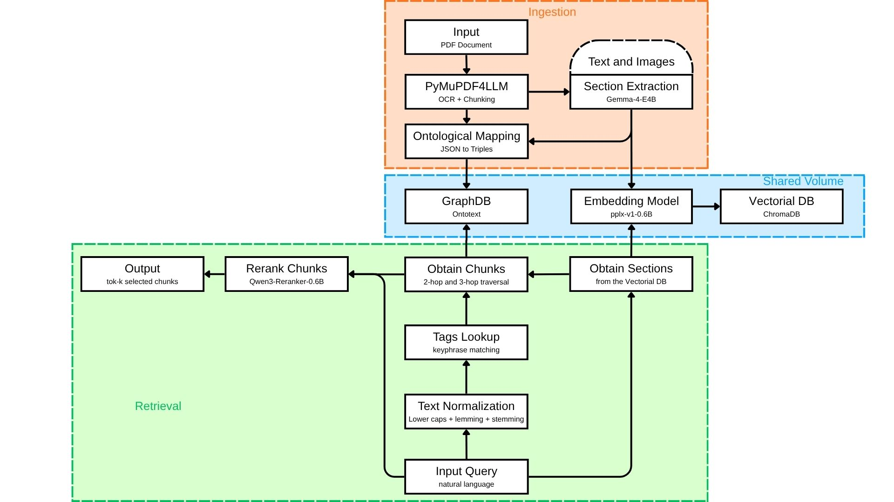
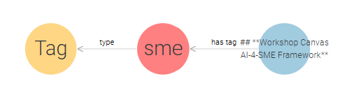
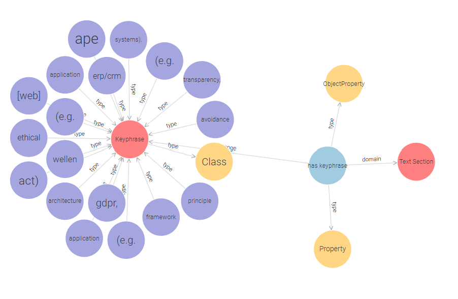

# KI-4-KMU Ingestion Layer

This project is part of the [KI-4-KMU initiative](https://www.ki-zentrum.ch/2025/07/03/fhnw-ki-praxisleitfaden-und-ki-canvas-ki-4-kmu-methode/) developed at FHNW, which aims to provide SMEs with practical AI tooling and methodology. This ingestion layer powers the knowledge platform behind the project, enabling document-grounded question answering over domain-specific PDFs.

A Hybrid RAG system combining a Vector Database ([ChromaDB](https://www.trychroma.com/)) and a Knowledge Graph ([GraphDB](https://graphdb.ontotext.com/)) to achieve better retrieval accuracy than traditional single-approach RAG systems. The two approaches complement each other's weaknesses, and results are merged and reranked before being returned. The system prioritizes local deployment and open-weight models wherever possible.

## Architecture



## Why Hybrid?

Neither vector search nor graph search is sufficient on its own:

| | Vector DB | Knowledge Graph |
|---|---|---|
| ✅ Strengths | Semantic understanding, natural language queries | Keyword & keyphrase matching, structured traversal |
| ❌ Weaknesses | Domain-specific terms, exact keyword lookup | Semantic ranking, cross-lingual queries |

A query like *"Give me the engine compression ratio of Chassis 3413GT"* benefits from both: the vector search finds semantically similar sections, while graph traversal retrieves chunks linked to nodes with concepts `chassis` or `compression`. The two result sets are merged and reranked — so the final output is both semantically coherent and keyword-precise. Crucially, the reranker can be swapped at any time without re-ingesting documents.

### Visual Graph Examples




## Features

- **Async PDF Ingestion**: Upload PDFs and poll for results — no blocking on long-running processing
- **Hybrid Search**: Vector semantic search + graph keyword traversal, merged and reranked
- **Graph Traversal**: Multi-hop concept traversal and concept co-occurrence expansion enrich retrieval beyond what vector search alone can reach
- **Large Candidate Pool**: Each retrieval arm independently fetches up to 50 candidates (tunable via `VECTOR_TOP_K`), then the full merged pool is reranked down to `top_k`
- **Local-first Reranking**: Reranking via local [Qwen3-Reranker-0.6B](https://huggingface.co/Qwen/Qwen3-Reranker-0.6B) — no external API dependency at query time
- **Multilingual**: Both the text embedder and reranker support multilingual input
- **Observability**: Full tracing and evaluation support via [Langfuse](https://langfuse.com/)
- **Local-first**: Designed to run fully on-premise using open-weight models; external APIs can be swapped with local inference via [LM Studio](https://lmstudio.ai/) for fully air-gapped deployments.
- **RESTful API**: Clean, versioned REST API with async job conventions
- **Docker**: Fully containerized via Docker Compose

## Graph Retrieval Visualizer

A live, step-by-step visualization of the hybrid retrieval pipeline is available at:

**http://localhost:8001/static/graph_viz.html**

After starting the services, enter a query and press **Run** to watch each stage unfold in real time via SSE:

1. **Vector search** — sections with highest embedding similarity
2. **Graph keyword** — chunks matched by concept/keyphrase lookup
3. **Resolve chunks** — vector sections resolved to their constituent text chunks
4. **Graph traversal** — chunks discovered via 2-hop concept and 3-hop co-occurrence hops
5. **Rerank** — final top-k results highlighted in the graph

Edges visually connect traversal chunks back to their seed vector sections, telling the multi-hop retrieval story.

## Technologies

| Component | Technology |
|---|---|
| API | [FastAPI](https://fastapi.tiangolo.com/) |
| Vector DB | [ChromaDB](https://www.trychroma.com/) |
| Knowledge Graph | [GraphDB (Ontotext)](https://graphdb.ontotext.com/) |
| Text Embedding | [pplx-embed-v1-0.6B](https://huggingface.co/perplexity-ai/pplx-embed-v1-0.6b) |
| Section Extraction SLM | [Gemma-4-E4B](https://huggingface.co/google/gemma-4-E4B) |
| Reranking | [Qwen3-Reranker-0.6B](https://huggingface.co/Qwen/Qwen3-Reranker-0.6B) |
| Observability | [Langfuse](https://langfuse.com/) |
| PDF Parsing | [PyMuPDF4LLM](https://github.com/pymupdf/RAG) |

## Ontology

The system uses a custom RDF/OWL ontology (`ontology/ontology.ttl`) to represent document knowledge in GraphDB.

**Classes:**
- `Document` — an ingested PDF
- `Chunk` — a raw text chunk extracted from a document page
- `Section` — a logical section identified by the SLM within a chunk (subclasses: `Text`, `Image`)
- `Concept` — a retrieval label assigned to a section by the SLM (e.g. `"compression"`, `"GDPR"`)
- `Keyphrase` — a lemmatized keyword algorithmically extracted from section text

**Object properties (relationships):**
- `Chunk` → `belongsTo` → `Document`
- `Chunk` / `Text` / `Image` → `isContained` → `Section` *(direction: chunk is contained in section)*
- `Section` → `hasConcept` → `Concept`
- `Text` → `hasKeyphrase` → `Keyphrase`
- `Concept` ↔ `coOccursWith` ↔ `Concept` *(built post-ingestion, symmetric)*

**Datatype properties:**
- `Document`: `document_id` (string), `pdf_hash` (string)
- `Chunk`: `text` (string), `chunk_index` (integer), `page_number` (integer)
- `Section`: `section_id` (string), `section_uuid` (string)
- `Image`: `image_base64` (string), `page_number` (integer)
- `Concept`: `concept_label` (string)

This structure means a query can reach relevant text chunks either by traversing concepts/keyphrases (graph path) or by finding the section in the vector DB and then fetching its child chunks (vector path).

## Graph Traversal

Concept nodes are **global hubs**: every section across all documents that receives the same concept (e.g. `gdpr`) points to the same single Concept node in GraphDB. This enables two graph traversal strategies that run on top of vector search results:

### 2-hop: Cross-section concept traversal

Starting from a section found by vector search, the graph follows its concepts to discover *all other sections in the knowledge base that share at least one concept*:

```
seed_section --hasConcept--> Concept <--hasConcept-- related_section --isContained--> chunk
```

This retrieves chunks that may use completely different vocabulary but are structurally labeled with the same concept — something cosine similarity cannot find.

### 3-hop: Concept co-occurrence expansion

After each document is ingested, `build_concept_cooccurrence()` scans all sections and inserts a `ki4kmu:coOccursWith` edge between every pair of concepts that appear together on the same section. This builds a concept-level co-occurrence graph automatically.

At query time, the traversal extends one more hop:

```
seed_section --hasConcept--> Concept_A --coOccursWith--> Concept_B <--hasConcept-- related_section --isContained--> chunk
```

This retrieves chunks about *topics that tend to go with* the seed section's concepts, even if they share no concept directly. For example, if `gdpr` and `datenschutzbeauftragter` co-occur frequently, a query seeding on `gdpr` will also surface chunks labeled only with `datenschutzbeauftragter`.

### Retrieval pipeline

Each arm independently fetches up to `VECTOR_TOP_K` (default: 50) candidates. The merged, deduplicated pool is reranked by Qwen3-Reranker-0.6B down to `top_k`. Traversal expansion stops after collecting `TRAVERSAL_LIMIT` (default: 100) unique chunks.

| Stage | Source | What it finds |
|---|---|---|
| 1 | Chroma vector search | Embedding-similar sections (up to 50) |
| 2 | Graph keyword search | Sections whose concepts/keyphrases match query terms (up to 50) |
| 3 | 2-hop concept traversal | Sections sharing concepts with vector results (up to 100 total) |
| 4 | 3-hop co-occurrence traversal | Sections thematically adjacent to vector results (up to 100 total) |
| 5 | Qwen3-Reranker-0.6B | Final ranked top-k from merged pool |

## Installation

### Prerequisites
- [Docker](https://www.docker.com/) and Docker Compose

### Setup

1. Clone the repository:
   ```bash
   git clone <repository-url>
   cd KI4KMU-IngestionLayer
   ```

2. Copy and fill in the environment file:
   ```bash
   cp .env.example .env
   ```

3. Start all services:
   ```bash
   docker-compose up --build
   ```

The API will be available at `http://localhost:8001`. Interactive docs at `http://localhost:8001/docs`.

## REST API

Base URL: `http://localhost:8001/v1`

### `GET /health`
Returns `{ "status": "ok" }` — use this to check the service is up.

---

### `POST /documents` — Ingest a PDF

Upload a PDF for async ingestion. Returns immediately with a job reference.

**Request:** `multipart/form-data`, field `file` (PDF only)

**Response `202 Accepted`:**
```json
{
  "job_id": "550e8400-e29b-41d4-a716-446655440000",
  "status": "pending",
  "status_url": "/v1/jobs/550e8400-e29b-41d4-a716-446655440000"
}
```

---

### `GET /jobs/{job_id}` — Poll Job Status

Poll until `status` is `completed` or `failed`. A 2–5 second interval is reasonable.

**Response `200 OK`:**
```json
{
  "job_id": "550e8400-e29b-41d4-a716-446655440000",
  "status": "completed",
  "filename": "document.pdf",
  "document_id": "aabbccdd-1234-5678-abcd-000000000000",
  "num_chunks": 15,
  "error": null
}
```

---

### `POST /query` — Hybrid Search

**Request body:**
```json
{
  "query": "engine compression ratio",
  "top_k": 5
}
```

**Response `200 OK`:**
```json
{
  "query": "engine compression ratio",
  "results": [
    {
      "id": "doc-uuid_chunk_3",
      "text": "The compression ratio of Chassis 3413GT is 2.1 bars...",
      "score": 0.94,
      "metadata": {
        "chunk_id": "doc-uuid_chunk_3",
        "section_id": "section-uuid"
      }
    }
  ]
}
```

---

## Ingestion Flow

```
1. POST /v1/documents       → 202 Accepted  { job_id, status_url }
2. GET  /v1/jobs/{job_id}   → poll until status = "completed"
3. POST /v1/query           → hybrid search results
```

## Testing

```bash
# Unit and slice tests
pytest

# All tests including smoke tests (requires running Docker services)
pytest --run-smoke
```
